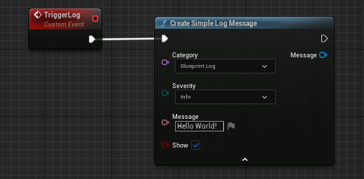
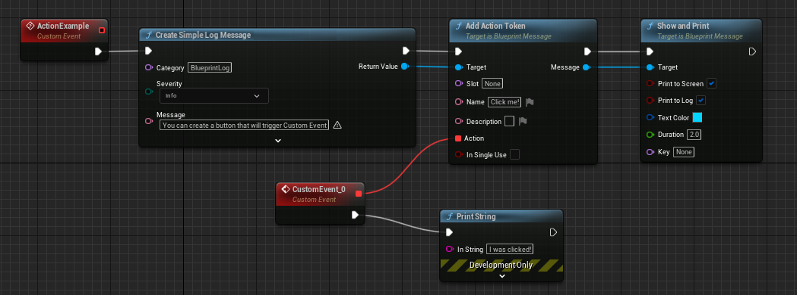
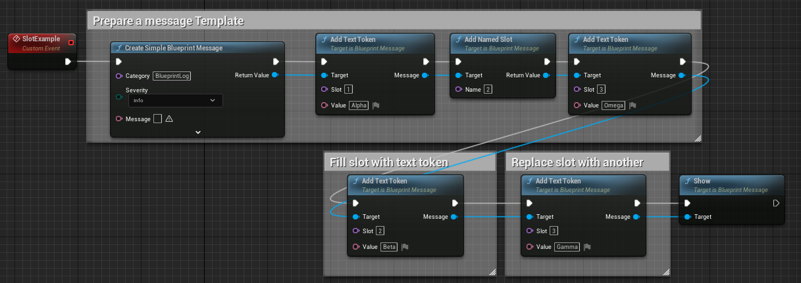

## Blueprint Message Log Plugin for Unreal Engine

Blueprint Message Log Plugin provides bridge between Blueprints and Editor Message Log API to enhance debugging experience with interactive logging features. 

Each Message Log message represented by sequence of tokens that represent plain text (text, string, name) or can be interacted with (hyperlinks, references, actions, images).

More details can be found in repo Wiki section.

## Features

 * Blueprint wrapper of Message Log API
 * Blueprint wrappers for builtin tokens:
   * FTextToken - plain text
   * FURLToken - hyperlink
   * FUObjectToken - reference to UObject
   * FActorToken - reference to Actor
   * FAssetNameToken - reference to Asset
   * FImageToken - image 
   * FTutorialToken - reference to tutorial asset
   * FDocumentationToken - reference to documentation 
   * FDynamicTextToken - dynamically updating text
   * FActionToken - execute blueprint delegate on click
   * FEditorUtilityToken - activates Blutility Widget
 * Message Slots - reserve a spot and fill it with token afterwards!
 * Custom tokens support

## Unreal Engine Versions

Plugin is compatible with 5.0-5.4, ue5-main and can be modified to work with other engine versions.

## Examples

Minimal "Hello World" can be as simple as this

You can also build message out of tokens directly

A simple message with reference to actor in world to locate it in one click

A simple message with executable action (in PIE only)

A simple message with action that activates an Editor Utility Widget

You don't need to make separate Format nodes as "Add Formatted Text Token" exists

Slots can be used to further format messages and replace tokens while building

Message Log View:

## Contributing

Please report any issues with GitHub Issues page for this repository.

If you want to suggest changes, improvements or updates to the plugin open an enhancement request issue or use GitHub Pull Requests.

## License

BlueprintMessagePlugin is available under the MIT license. See the LICENSE file for more info.

---

Special Thanks to Unreal Slackers Community Discord and #cpp 
