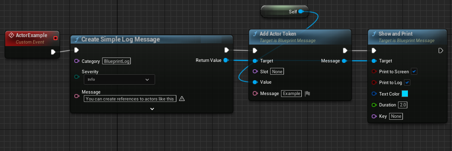

## Blueprint Message Plugin for Unreal Engine

Are you still printing plain text to output? Discover Message Log! Create rich interactive messages with different contents with little of blueprint.

Blueprint Message Plugin provides an easy bridge between Blueprints and Message Log API to open an era of interactive logging! 

Each Message Log message represented by sequence of tokens that can be interacted with: hyperlinks, references, actions, images.

Note: plugin is at experimental stage, things may change a lot.

## Features

 * Blueprint wrapper of Message Log API
 * Blueprint wrappers for tokens:
   * FTextToken - plain text
   * FURLToken - hyperlink
   * FUObjectToken - reference to UObject
   * FActorToken - reference to Actor
   * FAssetNameToken - reference to Asset
   * FImageToken - image 
   * FTutorialToken - reference to tutorial asset
   * FDocumentationToken - reference to documentation 
   * FDynamicTextToken (Soon...)
   * FActionToken (Soon...)
   * FEditorUtilityToken - activates Blutility Widget
 * Message Slots - reserve a spot and fill it with token afterwards!
 * Custom blueprint graph nodes for Create Message and Add Token (Soon...)
 * Custom tokens support

## Unreal Engine Versions

Tested with 5.0, ue5-main and can be modified to work with other engine versions.

## Examples

Minimal "Hello World"

Can build message out of tokens directly

A simple message with reference to actor in world

A simple message with executable action (in PIE only)

A simple message to prompt activation of Editor Utility Widget

A simple usage example of message slots

Message Log View:

## Contributing

Please report any issues with GitHub Issues page for this repository.

If you want to suggest changes, improvements or updates to the plugin use GitHub Pull Requests.

## License

BlueprintMessagePlugin is available under the MIT license. See the LICENSE file for more info.

---

Special Thanks to Unreal Slackers Community Discord and #cpp 
